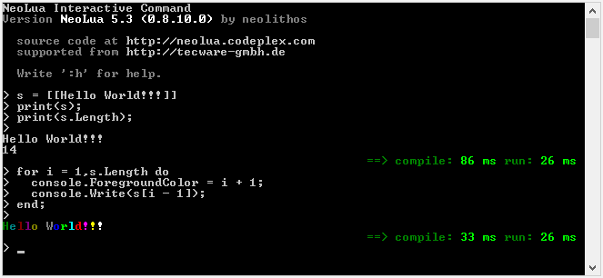

NeoLua
======

A Lua implementation for the Dynamic Language Runtime (DLR).

## Introduction

NeoLua is an implementation of the Lua language. Currently, the implementation is on 
the level of [Lua_5.3](http://www.lua.org/) (http://www.lua.org/manual/5.3/manual.html). 
The goal is to follow the reference of the C-Lua implementation and combine this with full 
.NET Framework support. That means, it should be easy to call .NET functions from Lua and it should 
be easy access variables and functions from a .net language (e.g. C#, VB.NET, ...).

NeoLua is implemented in C# and uses the [Dynamic Language Runtime](https://dlr.codeplex.com/). It therefore 
integrates very well with the .net framework.

### Quickstart

You can play and test the language with the tool NeoCmd.



Or there are two easy ways to use NeoLua in your project.

* Download the Neo.Lua.dll and add the reference.
* Install the [NuGet-Package](http://www.nuget.org/packages/NeoLua/) of NeoLua.


Simple example:
```C#
using (Lua l = new Lua()) // create the lua script engine
{
  dynamic g = l.CreateEnvironment(); // create a environment
  g.dochunk("a = 'Hallo World!';", "test.lua"); // create a variable in lua
  Console.WriteLine(g.a); // access a variable in c#
  g.dochunk("function add(b) return b + 3; end;", "test.lua"); // create a function in lua
  Console.WriteLine("Add(3) = {0}", g.add(3)); // call the function in c#
}
```

NeoLua is a .net 4.0 assembly (IL). There is will be no support for .net frameworks lower than 4.0. 

### What NeoLua is useful for

* Outsource the logic of your application into scripts
* Structuring of logic
* Build a dynamic configuration system, with functions and variables
* As a formula parser
* ...

So, this could be reliable partner for your compiled .NET application or engine (e.g. Game Engines).

### What I did not have in mind

* Compiling libraries
* Standalone applications

### Advantages of NeoLua

* Dynamic access between Lua script and and the host application/.NET framework and vice-versa.
* NeoLua is based on the DLR. So you get compiled code that is collectable and well-optimized.
* It is compatible with the .NET world (e.g. C#, VB.NET, IronPython, ...).
* Full and easy access to the .NET framework or your own libraries (with no stub code).
* A rich implementation of the lua table, for a got integration in the .net world e.g. Binding, Enumeration, ...
* A .NET Framework Garbage Collector that is well-tested and very fast.
* Pure IL (x86,x64 support)

### Drawbacks of NeoLua

* It is not [100% compatible](http://todo) to Lua. But I will try very hard.
* No deployment of precompiled scripts.

### Drawbacks of bridges to c-lua, that are solved with NeoLua

* You have two memory managers and so you have to marshal every data between these two worlds. That takes time and there are a lot pitfalls to get memory leaks.
* C-Lua interprets its own bytecode. The code is not compiled to machine code.

## Documentation

*This documention has the same structure like the official reference ([Lua 5.3](http://www.lua.org/manual/5.3/manual.html)), so it should be easy to compare the two worlds.*

1. Introduction
2. [Basic concepts](doc/02_basics.md)
3. [Language](doc/03_language.md)
4. Application Program Interface
    1. [Getting started](doc/04_01_start.md)
    2. [Script engine](doc/04_02_engine.md)
    3. [Chunks](doc/04_03_chunk.md)
    4. [Table's](doc/04_04_table.md)
5. The Auxilary Library
    1. [clr library](doc/05_01_clr.md)
    2. [Extent lua table](doc/05_02_extent.md)
    3. [Debugging](doc/05_03_debug.md)
6. [Standard libraries](doc/06_std.md)
7. [NeoCmd](doc/07_neocmd.md)

If there is something unclear, wrong or misunderstanding please use the discussions.

## Links

* Article on CodeProject: http://www.codeproject.com/Articles/674128/NeoLua-Lua-for-the-net-dynamic-lanuguage-runtime
* Nuget package: https://www.nuget.org/packages/NeoLua/
